# Swapify Music Player

Swapify Music Player is a beautiful music player made with HTML, CSS, and JavaScript. It provides an immersive and enjoyable music listening experience on PCs.

## Features
- Elegant and intuitive user interface.
- Play, pause and skip.
- Interactive progress bar for tracking the current song.
- Responsive design optimized for PCs.

## Demo
[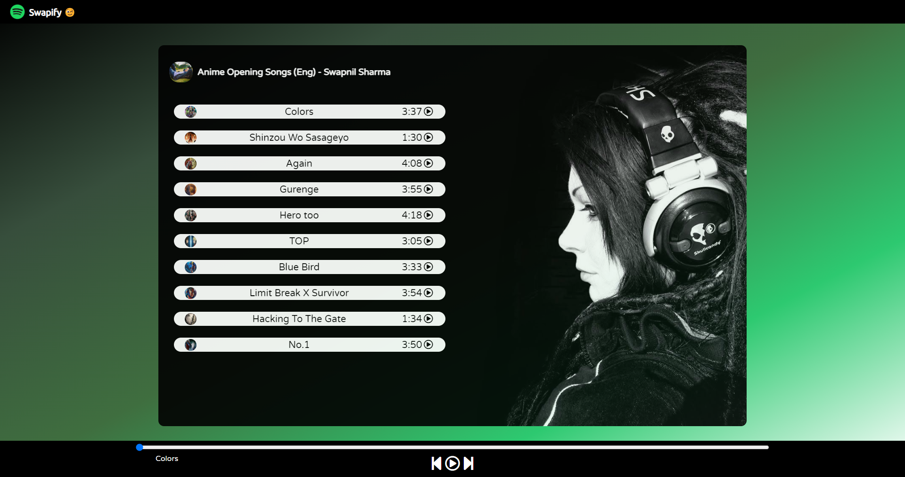](https://swapnil-11-04-01.github.io/Swapify-MusicPlayer/)

Click the image above to try out Swapify Music Player in your browser.

## Screenshots
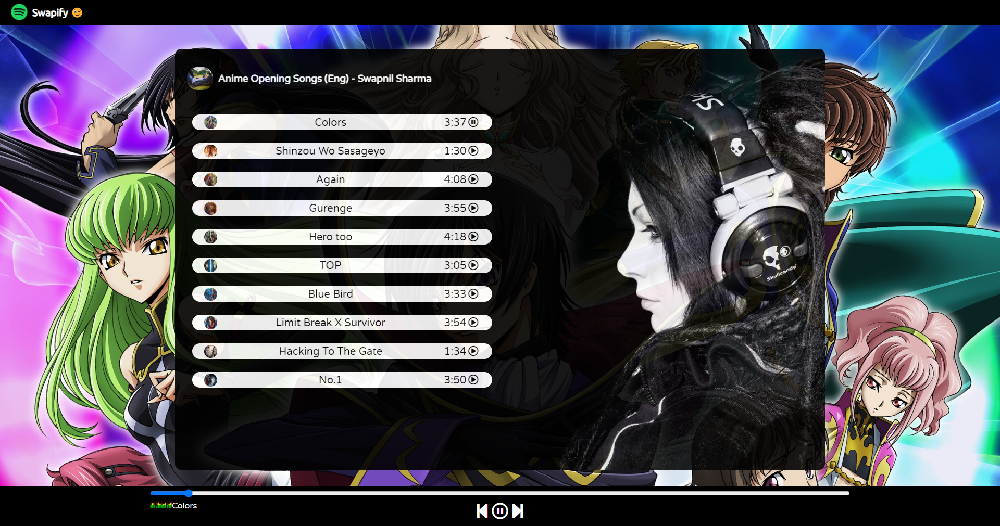
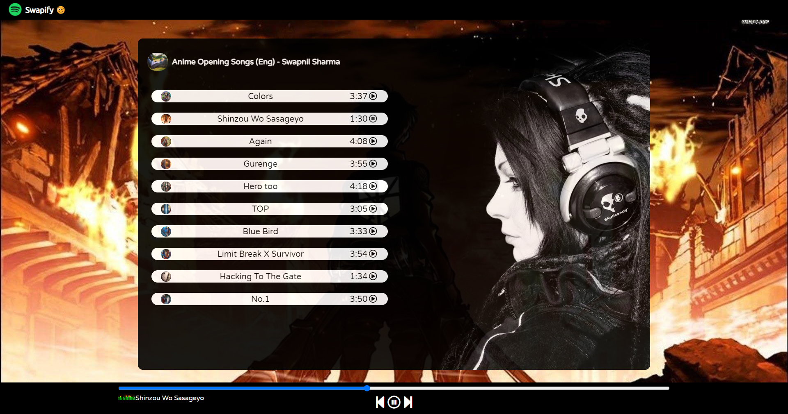
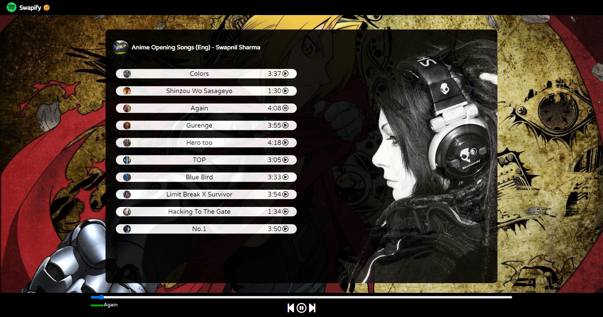
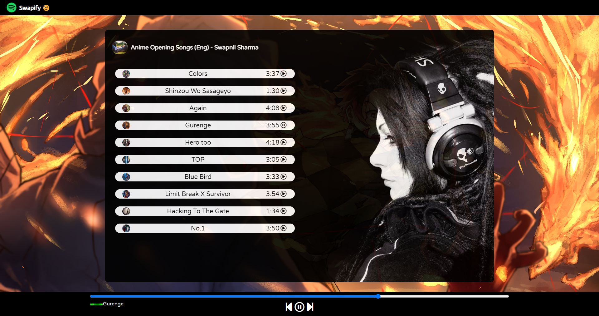
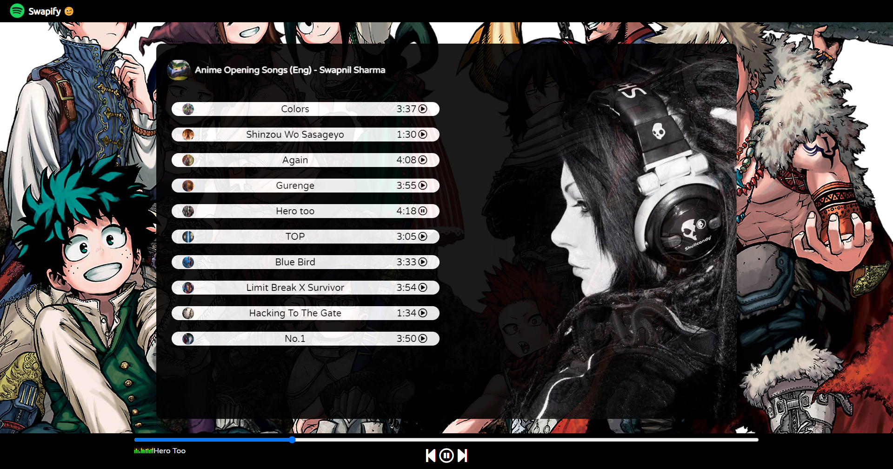
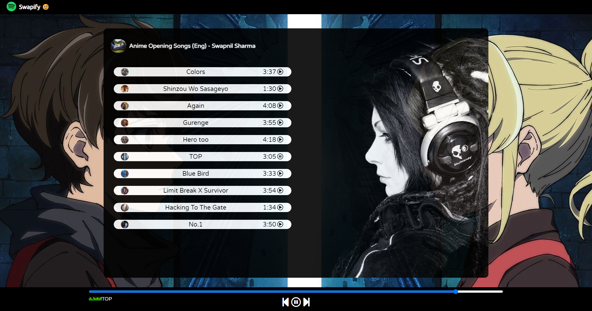
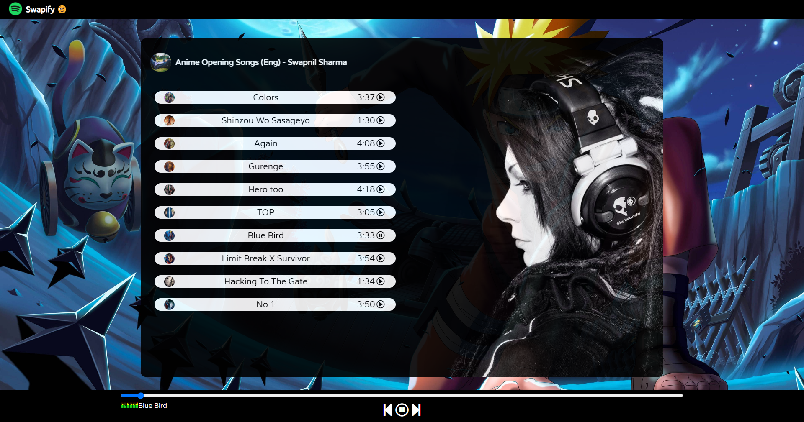
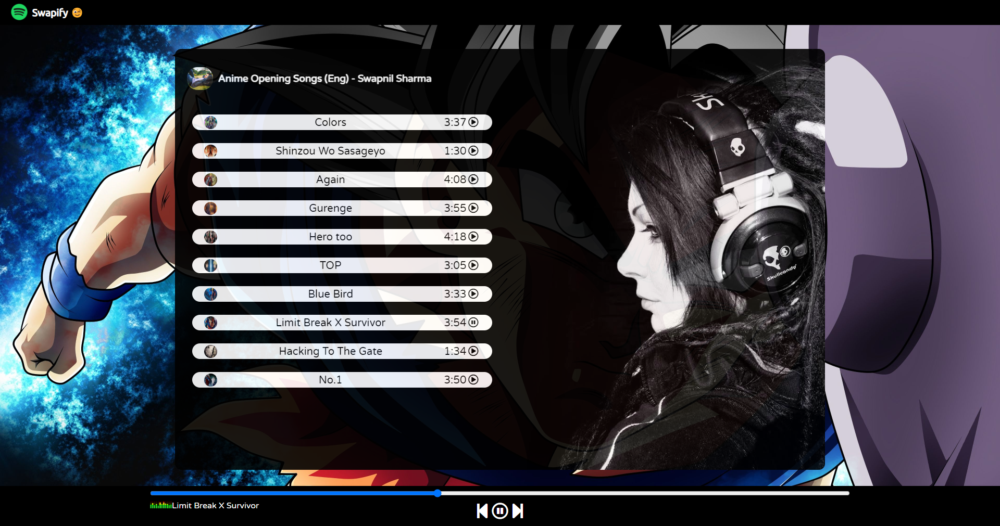
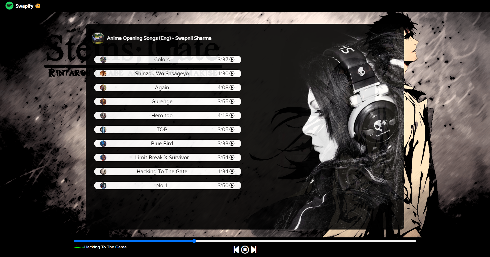
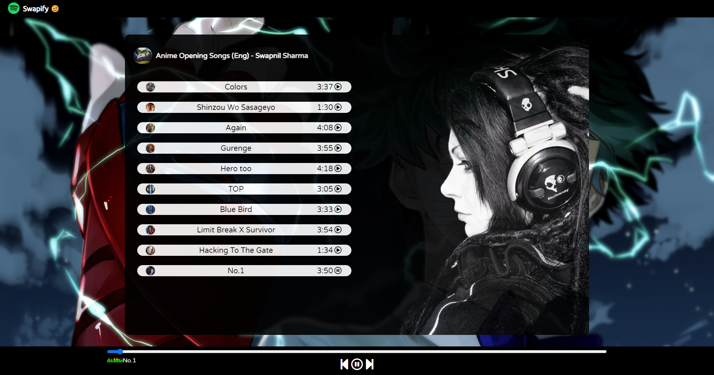

## Usage
Simply open the [Swapify Music Player](https://swapnil-11-04-01.github.io/Swapify-MusicPlayer/) link in a web browser on your PC to start using the music player. Ensure that you have a stable internet connection.

## Contributions
Contributions are welcome! If you have any ideas or suggestions to improve the music player, feel free to submit a pull request.
